# SponsorX — Phase 1 Design Record (§38 deliverable)

**Version 1.0 · 2026-09-12 · Task `P1-PMO-01`**
Captures the twelve §9 core screens as built, on branch `P1-FE-QA-PMO`
(fixture stage — Stage 1 complete). Screenshots in
[design-record/](design-record/) were taken from the running build at 1440px,
dark theme. **Schematic wireframes for all twelve screens:**
[design-record/SponsorX-Wireframes.html](design-record/SponsorX-Wireframes.html)
(self-contained, printable; solid buttons = live affordances, dashed =
deliberately unwired in Stage 1). Every screen also supports the **Frost light theme**
(`html[data-theme=light]`, toggle in portal chrome) and the `?demo=` state
switcher (`loading` · `empty` · `error`, plus `minor` on the athlete portal).
All statistics carry provenance chips per §22, and every displayed number has
a named retrieval path (the standing `stats-must-be-retrievable` rule).

Quality baselines this record inherits (see `docs/superpowers/audits/`):
no horizontal scroll at 360px on any route; WCAG AA contrast in both themes;
the §39 loop walks end-to-end with every unwired control annotated; no
sponsor-facing screen renders `AthleteRate.amount`, no athlete-facing screen
renders `Campaign.budget` (§26, guide §04).

---

## Screen 1 · SponsorX Network Landing — `/`
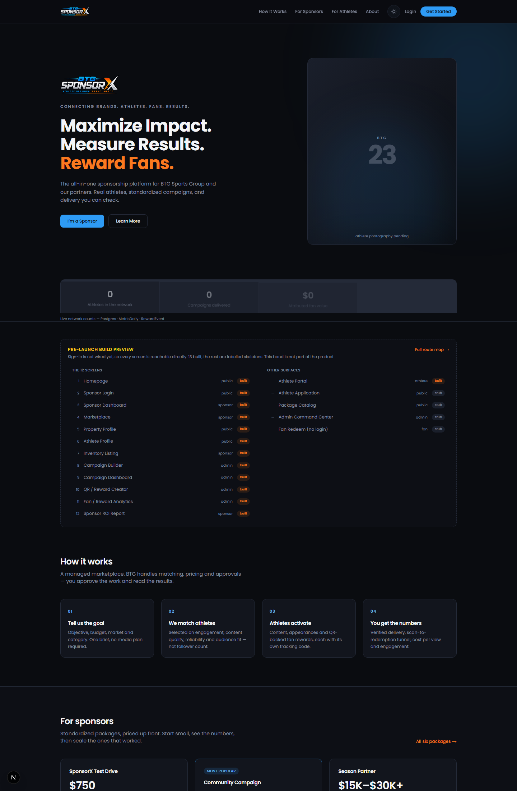
Public marketing site: hero with live network counters (count-up over
`networkStats` — Postgres counts/sums, sourced per tile), the 12-screen
gallery, package presentation and both sponsor/athlete CTAs. Hero imagery is
placeholder pending `P1-ART-06`.

## Screen 2 · Login — `/login`
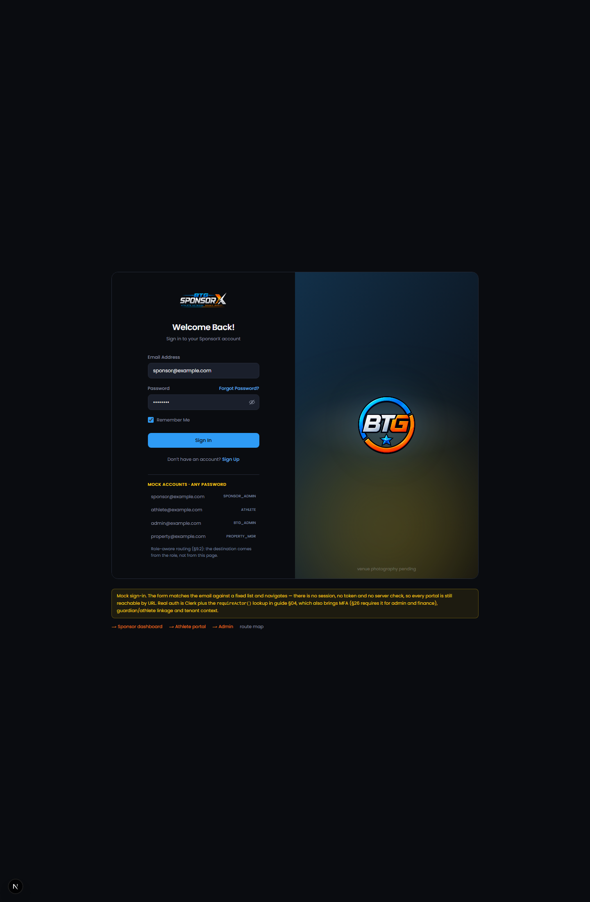
Mock role-picker login (athlete / sponsor / property / admin). Clerk replaces
this at `P2-INT-01`; the picker exists so every portal is demoable without
auth. No credentials are collected.

## Screen 3 · Sponsor Dashboard — `/sponsor`
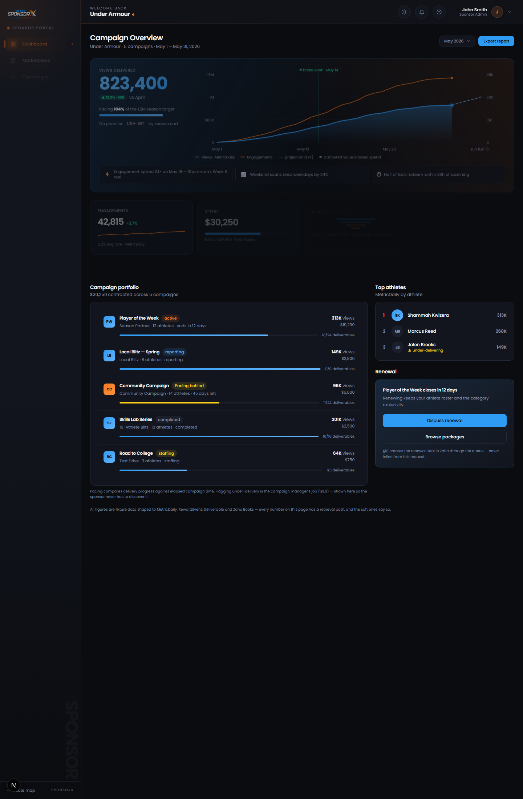
Command-deck hero (views delivered vs target, pacing, projection tail with
break-even marker — MetricDaily), bento KPIs (engagement sparkline, spend vs
Zoho Books budget, reward funnel), data-trust provenance bar, campaign
portfolio with pacing chips (c3 "Community Campaign" is the canonical
PACING BEHIND row), top athletes, renewal card.

## Screen 4 · Sponsor Marketplace — `/sponsor/marketplace` (public catalog: `/packages`)
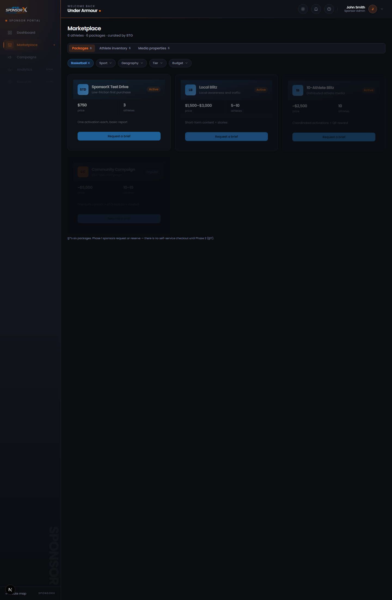
Three-tab catalogue (§7 packages first, athlete inventory, media properties).
Sponsor prices only. Filter chips are decorative until the §13 eligibility
query (B3); "Add to brief" / "Request a brief" create a DRAFT CampaignBrief
when wired. SOLD_OUT dims to a waitlist CTA.

## Screen 5 · Athlete Profile (sponsor-facing) — `/athletes/[slug]` (sibling: Property Profile `/properties/[slug]`)
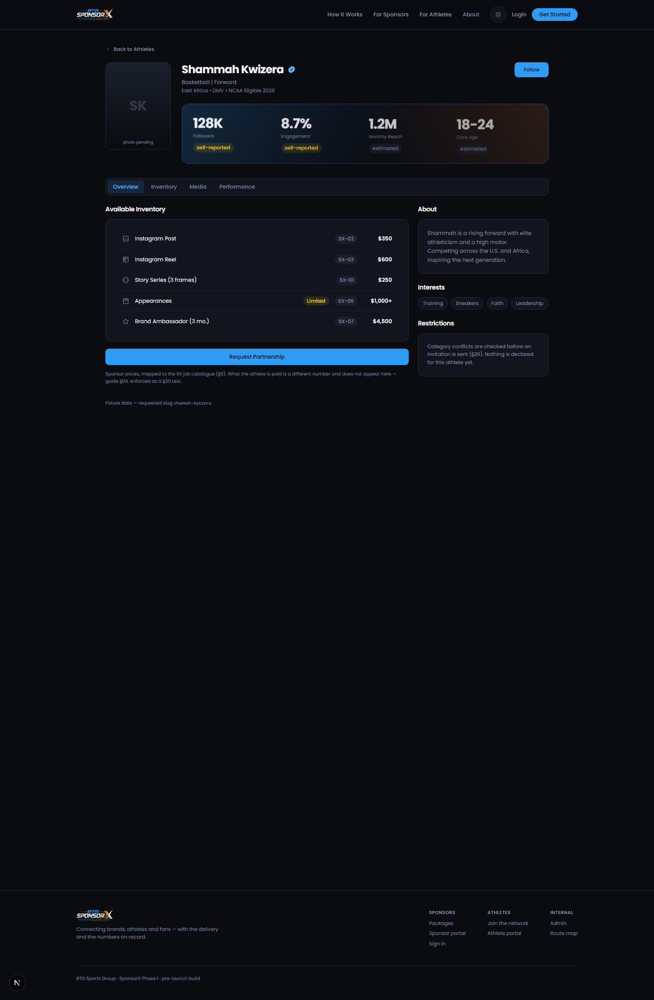
Public profile at sponsor prices with provenance-labelled stats
(SELF_REPORTED / VERIFIED / ESTIMATED). Portrait slot awaits R2 photography.
`AthleteRate.amount` never renders here (audited).

## Screen 6 · Athlete Portal — `/athlete`
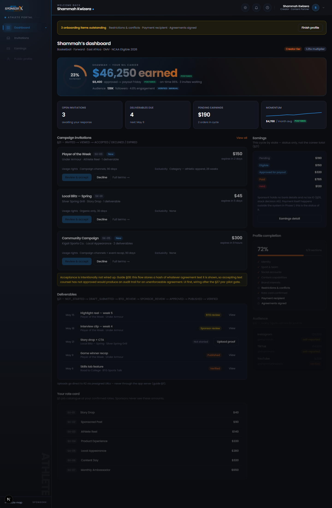
Milestone hero (career earnings, payout ring, on-time, audience — Postgres),
invitation inbox (§21 lifecycle incl. declined/expired edge rows),
deliverable pipeline, rate card (athlete's own rates — the one place they
render), earnings by state incl. HELD, guardian section. `?demo=minor`
renders the §4 guardian-pending variant with gated actions.

## Screen 7 · NIL Job / Inventory Detail — `/sponsor/marketplace/[jobId]`
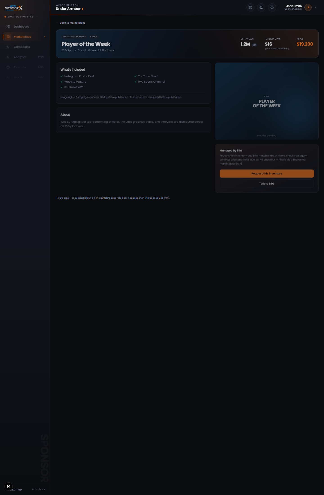
Hero band (EXCLUSIVE chip, est-views EST chip, implied CPM §15, price),
includes grid, artwork placeholder, "Managed by BTG" rail (request /
talk-to-BTG CTAs — managed model, no checkout §17).

## Screen 8 · Campaign Builder + Athlete Matching — `/admin/campaigns/new`
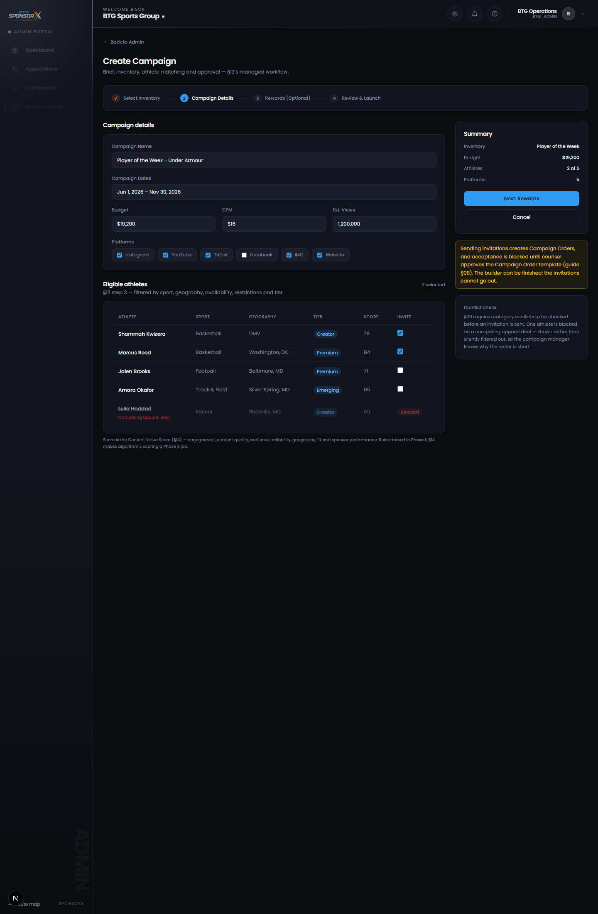
Staff-side builder (§13): campaign details, eligible-athlete table with
rules-v1 scores and conflict flags (the mockup omitted eligibility — §13
step 3 requires it), platforms, summary rail. Launch is annotated (sends
CampaignInvites, moves to STAFFING — not wired).

## Screen 9 · Campaign Operations Dashboard — `/admin/campaigns/[id]`
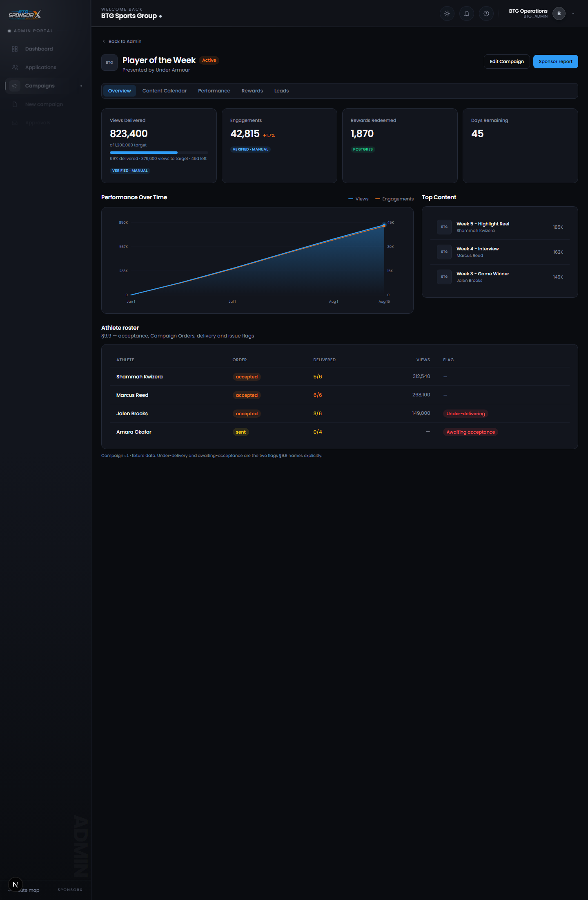
Resolves by campaign id (`campaignDetailX`): c1 healthy, c3 the canonical
under-delivering campaign (11/22 deliverables, warning notice, declined
roster order "Replacement needed"). §9.9 roster: acceptance, delivered vs
planned, views, issue flags.

## Screen 10 · QR / Reward Creator — `/admin/rewards/new`
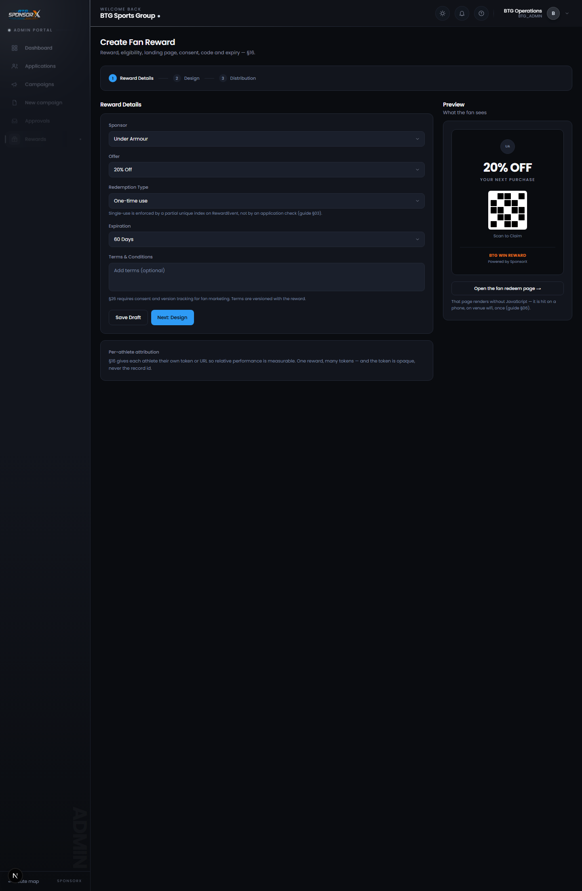
Three-step reward builder (details, design, distribution) with live fan-card
preview. Save-as-DRAFT annotated as unwired. Reward terms review is
`P0-LEG-05`.

## Screen 11 · Analytics / Athlete Performance — `/admin/analytics`
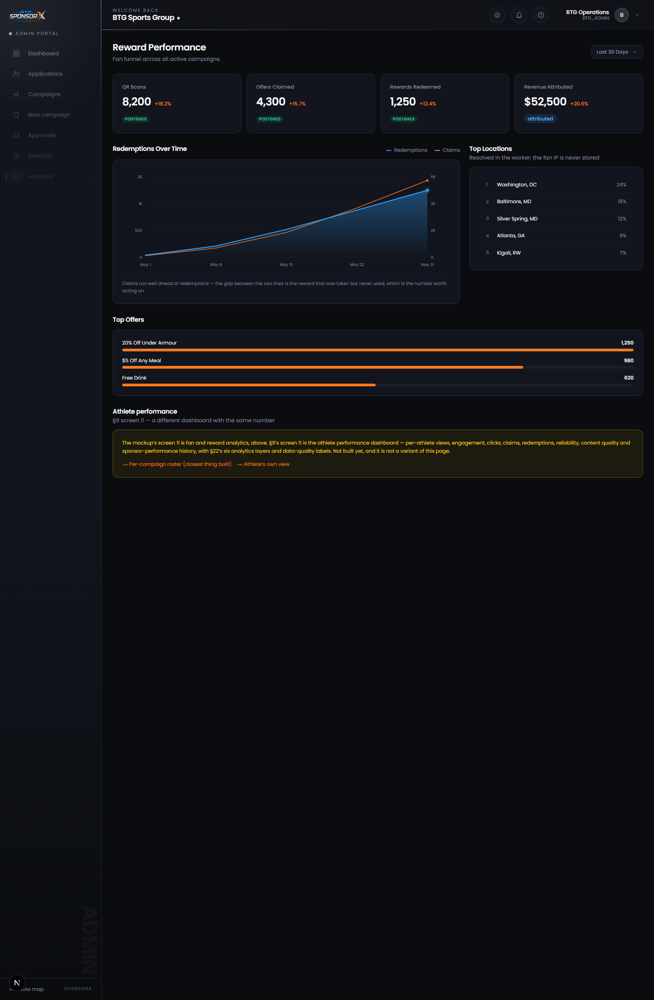
Fan/reward analytics (§16 funnel events as separate stages), redemption
series, top locations (city-level only — no IP stored), top offers, athlete
performance. §22 sourcing on every figure.

## Screen 12 · Sponsor ROI / Campaign Report — `/sponsor/campaigns/[id]/report`
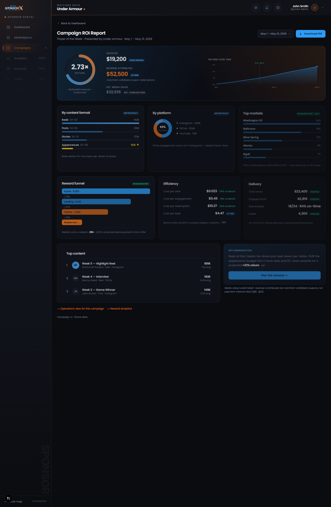
Radial ROI gauge centerpiece with the money story (invested ZOHO BOOKS ·
attributed · EST curated-CPM media value), return-over-time with 1.0×
break-even, format/platform/geo composition, funnel with stage conversions,
efficiency vs curated benchmarks, top content, recommendation card. §16/§22
sourcing footnote. Print/PDF layout is `P1-ART-04` (blocked on `P0-PMO-05`).

---

## Supplementary surfaces built alongside the twelve

| Surface | Route | Refs |
|---|---|---|
| Athlete application (ten §11 sections, guardian branch) | `/join` | §11 |
| Campaign invitations inbox | `/athlete/invitations` | §21 |
| Campaign Order acceptance (terminal + minor states) | `/athlete/orders/[id]` | §12, guide §08 |
| Athlete earnings detail | `/athlete/earnings` | §24 · §21 |
| Property portal | `/property` | §8 |
| Admin command center / applications / approvals / finance | `/admin`, `/admin/applications`, `/admin/approvals`, `/admin/finance` | §10 · §23 |
| Fan redeem (no login, no JS required) | `/r/[token]` | §16 |
| Route map | `/map` | — |

## Regenerating the captures

Screens were shot with headless Chrome
(`--headless=new --window-size=1440,2200 --screenshot=<file> <url>`) against
`next dev` with the fixture data. Re-capture after any visual change so the
record stays the record.
